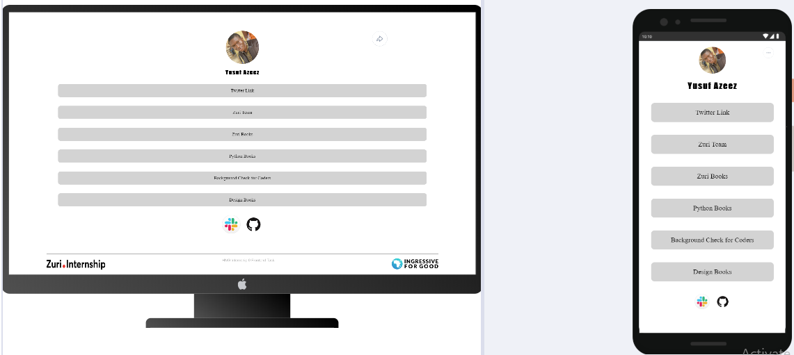

# Linktree

This is a customizable webpage that houses all the important links that you want to share with your audience. It's built with `react` and `create-react-app`.

## Built With

- React/Redux
- CSS
- Create-react-app
- npm
- ES6

## Getting Started

To get a local copy up and running follow these simple example steps.

- On the project GitHub page, navigate to the main page of the repository [this page](https://github.com/YussaMoney/linktree.git).
- Under the repository name, locate and click on a green button named `Code`.
- Copy the project URL as displayed.
- If you're running Windows Operating System, open your command prompt. On Linux, Open your terminal.
- Change the current working directory to the location where you want the cloned directory to be made. Leave as it is if the current location is where you want the project to be.
- Type `git clone`, and then paste the URL you copied in Step 3. 
  `$ git clone https://github.com/YussaMoney/linktree.git`
- Press Enter. Your local copy will be created.

## Live Demo

[Click here](https://)

## Prerequisites

- [Git](https://gist.github.com/derhuerst/1b15ff4652a867391f03)
- Web browser(chrome)
- [Node](https://nodejs.org/en/)
- [npm](https://www.npmjs.com/get-npm)

### Making Changes

- `npm install` to install the dependencies and packages
- `npm start` to test the app after changes were made

## Author

👤 **Azeez Yusuf O.**

- Github: [@YussaMoney](https://github.com/YussaMoney)
- Twitter: [@YussaMoney](https://twitter.com/YussaMoney)
- Linkedin: [@YussaMoney](https://www.linkedin.com/in/yussamoney)

## 🤝 Contributing

Contributions, issues and feature requests are welcome!

## Show your support

Give a ⭐️if you like this project!

## Acknowledgement

- [Teekaytech](https://github.com/Teekaytech)
- [The Odin Project](https://www.theodinproject.com/paths/full-stack-javascript/courses/javascript#react-js)
- [Microverse](https://github.com/microverseinc/linters-config/tree/master/react-redux)
- [Zuri Team](https://training.zuri.team/)
